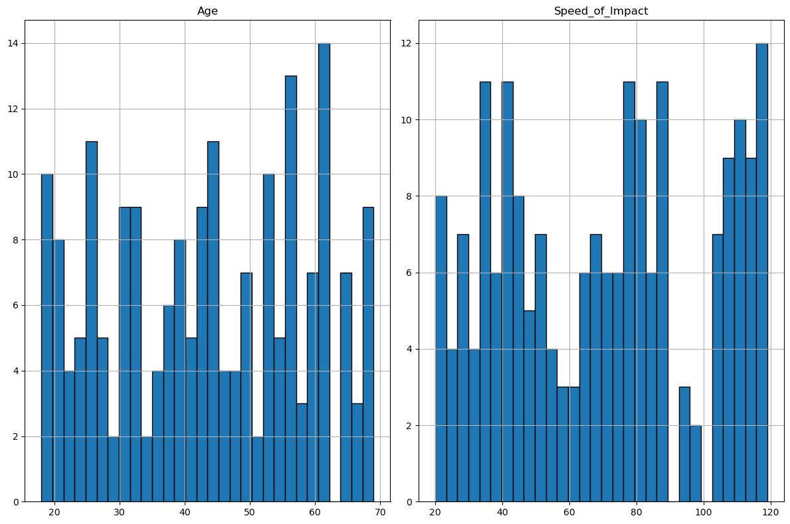
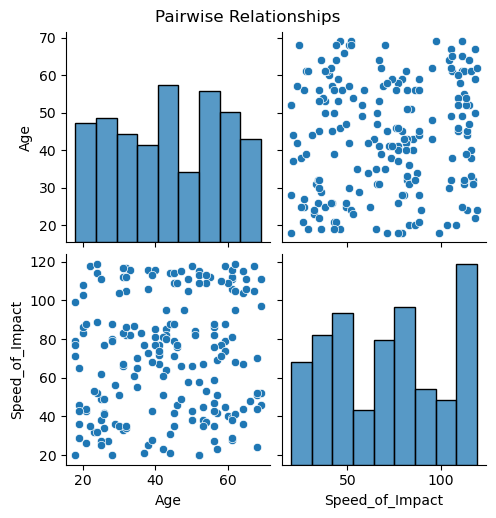
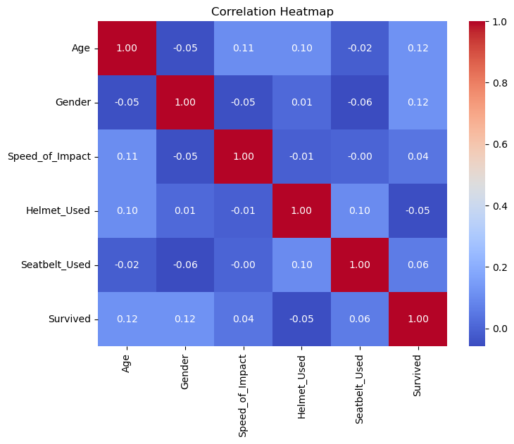

# Survival-Prediction-Project 
# Logistic Regression
> This project predicts the survival of persons who faced an accident using a dataset. We performed data cleaning, Exploratory Data Analysis (EDA), and trained our model on the data.
---


# Data Description
The dataset used here is accident.csv from **Kaggle**. It has 5 features and 200 records:

- **Age**
- **Gender**
- **Speed of impact**
- **Seatbelt Used**
- **Helmet Used**


Goal: To predict whether a person survived after an accident or died.

---
## Project Structure

``` Bash
📦 Cafe-Sales-Analysis
┣ 📜 Main Notebook     # Main notebook
┣ 📊 Datasets          # Dataset (CSV file)
┣ 📷 Images            # Visualizations and outputs
┗ 📄 README.md         # Project overview
```
---

## 🔰 Step-by-Step Breakdown

### 📌 Step 1: Load and Preview the dataset

We start by loading the dataset and taking a preview of it. How the data looks, its null count, and the features' data type. 

### 📌 Step 2: Handling error values and converting column values into binary

We will remove the error values from the dataset. Some of the columns like **Gender**, **Seatbelt Used**, and **Helmet Used** have string values but they can be converted into binary categories. So we need to convert them into 0, 1 to make them useful for the model.

# EDA with Plots Interpretations
### 📌 Step 3: Data Distribution (Histograms)

Histograms show the distribution of each feature. This helps us understand skewness, spread, and whether scaling might be needed.

#### 1. 📷 Histogram:



### 📌 Step 4: Pairplot

Pairplots allow us to visually inspect linear or nonlinear relationships between features and the target (`Survived`).

#### 2. 📷 Pair-wise Relationship  


### 📌 Step 5: Correlation Heatmap:

This heatmap shows the strength of relationships between variables.

#### 3. 📷 Heatmap:



### 📌 Step 6: Linear Regression

We fit a Logistic Regression model to predict Survival based on the feature data.

---
## 🔍 Final Findings:
### 📌 Step 7: Model Score


Accuracy: 0.5

Classification Report:
               
               precision    recall  f1-score   support

           0       0.73      0.32      0.44        25 
           1       0.41      0.80      0.55        15 

    accuracy:                          0.50        40 
    macro avg:     0.57     0.56       0.49        40 
    weighted avg:  0.61     0.50       0.48        40 


Confusion Matrix:
[[8   17] 
[3   12]] 

**Model Coefficients:**
| Features           |Coefficient
|--------------------|------------
|Age                 |0.233760
|Gender              |0.315572
|Speed_of_Impact     |0.016026
|Helmet_Used         |-0.242229
|Seatbelt_Used       |0.064817      

---
## 💻 Run It Yourself

### 1. Clone the repository

```bash
git clone https://github.com/fahadkhalid695/Survival-Prediction-Project.git
cd Survival-Prediction-Project/Main Notebook
```
### 2. Open the Jupyter notebook

**Logistic Regression.ipynb**

---
## 🧠 Skills Demonstrated

📌 Data Cleaning & EDA

📌 Data Visualization with Matplotlib & Seaborn

📌 Python Libraries: Pandas, NumPy, Scikit-learn

---
## 📂 Data Source
[Kaggel](https://www.kaggle.com)

---
## 📮 Connect with Me

### 🔗 LinkedIn
[Fahad Khalid](https://www.linkedin.com/in/fahadkhalid695/)
